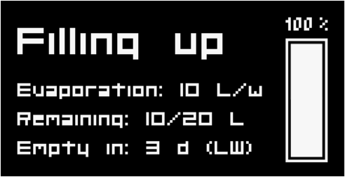
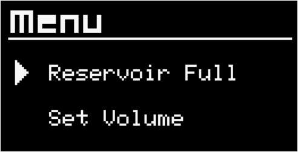
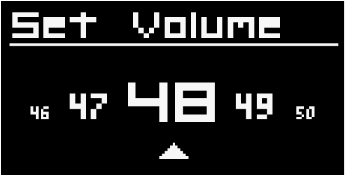

# AquaBot_ATO - Automatic Top-Off System

## Project Description

AquaBot_ATO is an innovative automatic top-off system designed specifically for aquariums. It efficiently regulates water levels while ensuring the safety of aquarium operations. By utilizing modern technology and intelligent safety mechanisms, AquaBot_ATO guarantees that your aquarium is always optimally supplied with water, eliminating the risk of overflow.

## System Overview

The core of the AquaBot_ATO system is an Arduino Nano, which controls and monitors all functions. The system is powered by a 12V power supply, with a step-down converter reducing the voltage to 5V for the Arduino. 

### Water Level Sensors

Stainless steel probes are used as water level sensors, divided into two separate systems:

1. **Main Control:** The first sensor is directly connected to the Arduino and measures the water level hourly. A 10k resistor ensures that the Arduino reads the sensor value through an analog input. The sensor checks for a stable high or low value over a period of 5 seconds to determine if it is in contact with water.

2. **Emergency Shutdown:** The second sensor is decoupled from the Arduino and serves as a safety mechanism. If the water level reaches above a critical point, a MOSFET (IRLZ44N) shuts down the pump to prevent overflow. 

## Safety Mechanisms

AquaBot_ATO implements two essential safety mechanisms to prevent aquarium overflow:

- **Pump Control:** The Arduino allows the pump to run for a maximum of 10% longer than the previous pumping duration. If this time is exceeded, the Arduino deactivates the MOSFET and triggers an alarm that requires confirmation before a new refill operation can start.

- **Emergency Shutdown:** If the water level exceeds the sensor and activates the emergency shutdown, a second MOSFET is deactivated, cutting off the power supply to the pump to prevent overflow.

## User Interaction and Status Display

The system status is indicated by an RGB LED on the sensor and displayed on a connected OLED display. A simple push button allows users to manually interact with the device and check the system status.

- **Constant Green:** Water is filled up to the desired level.
- **Blinking Blue:** Pump is running / water is filling up.
- **Blinking Red:** Error detected in the system.
- **Constant Yellow:** Refill reservoir is about to be empty (warning).
- **Blinking Yellow:** Refill reservoir is critically low (immediate attention required).

### OLED Display

The system features an OLED display with a main view and a small menu. 

The main view gives information about the current systems status, how much water evaporates, how many water the reservoir still remains and for how many days the remaining water lasts until it needs to be refilled. 

To enter the menu, do a Long Press (2+ sec.). There are two menu points you can choose from. Either telling the system that you have refilled your reservoir or setting the net volume of your reservoir (the amount of water which can actually be pumped out). You can choose the menu point by doing a Short Press. A Double Press selects the point.

Long Press the point "Reservoir Full", restores the remaining volume of the reservoir to the set volume. After a short selection screen the menu exits automatically.

Long Press the point "Set Volume" leads to a settings page where you can select the net volume of the water which can actually be pumped into the aquarium, taking into account that the reservoir can't be filled 100% to the top and that always a small amount of water will remain at the bottom which can't be sucked up by the pump. This net volume needs to be tested individually. The max. net volume available is 50 liters.

You can change 1 by a Short Press and 10 by Double Press. When you have reached your desired net volume, define it via a Long Press and the menu will automatically exit after a short selection screen. 

## Protection Measures

To protect the electronics from voltage spikes and inductive backflows, a capacitor (100-400 µF electrolytic capacitor) and a diode (1N5401) are integrated. These components ensure the longevity and reliability of the system, especially during the pump's on/off cycles.

## Conclusion

AquaBot_ATO is a well-thought-out and safe solution for automatic water level control in aquariums. With its advanced safety mechanisms and user-friendly interface, it provides aquarium owners with the assurance that their fish and plants are always in an optimal environment.

## Components Used

- **Microcontroller:** Arduino Nano
- **Power Supply:** 12V power supply with a step-down converter (12V to 5V)
- **Water Level Sensors:** Stainless steel probes
- **MOSFETs:** IRLZ44N
- **Diode:** 1N5401
- **Capacitor:** 100-400 µF electrolytic capacitor
- **Resistor:** 10k resistor

Feel free to contribute to the project or reach out with any questions or suggestions!